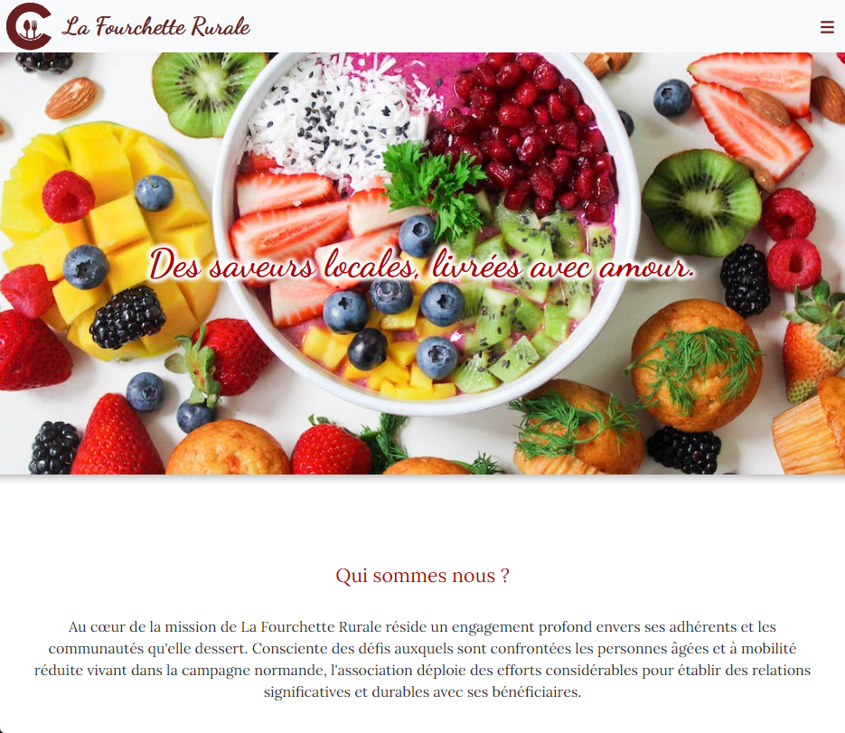

## Description

Cette application est conçue pour faciliter la livraison de repas à domicile pour les personnes à mobilité réduite. Elle est développée en Java 1.8 et ne dépend d'aucun framework tel que Spring. 
Il s'agit d'une application multi-couche ou les logiques métiers sont séparer de l'accès à la base de donnée et du controller qui envoie les information au front-end.
Le front end est réaliser en HTML/Javascript avec utilisation de bootstraps
L'application utilise une base de données MySQL 5.7.36 et est déployée sur un serveur JBoss 7.4.

## Prérequis

- Java 1.8
- MySQL 5.7.36
- Serveur JBoss 7.4

## Configuration de la base de données

1. Assurez-vous que MySQL est installé et fonctionne sur votre machine.
2. Créez une base de données spécifique pour l'application. Vous pouvez nommer cette base de données selon vos préférences.
3. Peulez votre base de données en utilisant le fichier `lafourchetterurale.sql` qui contient toutes les tables et données initiales nécessaires pour une démonstration.

## Déploiement

1. Compilez le code source Java avec JDK 1.8 pour garantir la compatibilité.
2. Déployez l'archive générée (WAR ou EAR selon votre configuration de build) sur le serveur JBoss 7.4.
3. Assurez-vous que le serveur JBoss est configuré pour utiliser le port et les paramètres de connexion correspondant à votre configuration MySQL.

## Utilisation

Après le déploiement, l'application peut être accessible via l'adresse IP de votre serveur JBoss suivi du contexte de l'application déployée.

Elle prend en charge différents profils d'utilisateur qu'elle reconnais dans une même interface de connexion : Utilisateur de l'application, Administateur et livreur de repas

## Fichier de Configuration

- `bdd_and_information.txt`: Ce fichier contient des informations supplémentaires et des configurations qui peuvent être nécessaires pour personnaliser ou mettre à jour les paramètres de l'application.
- `LaFourchetteRurale_db.properties` : pour définir les information de connexion à la base de données

